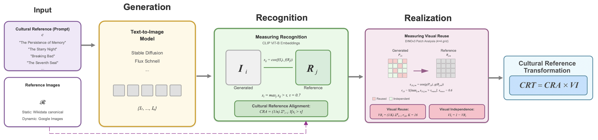

## Code for "The Persistence of Cultural Memory: Investigating Multimodal Iconicity in Diffusion Models"



Our work addresses the ambiguity between generalization and memorization in text-to-image diffusion models, focusing on a specific case we term multimodal iconicity. This refers to instances where images and texts evoke culturally shared associations, such as when a title recalls a familiar artwork or film scene. While prior research on memorization and unlearning emphasizes forgetting, we examine what is remembered and how, focusing on the balance between recognizing cultural references and reproducing them. We introduce an evaluation framework that separates recognition, whether a model identifies a reference, from realization, how it depicts it through replication or reinterpretation, quantified through measures capturing both dimensions. By evaluating five diffusion models across 767 Wikidata-derived cultural references spanning static and dynamic imagery, we show that our framework distinguishes replication from transformation more effectively than existing similarity-based methods. To assess linguistic sensitivity, we conduct prompt perturbation experiments using synonym substitutions and literal image descriptions, finding that models often reproduce iconic visual structures even when textual cues are altered. Finally, our analysis shows that cultural alignment correlates not only with training data frequency, but also textual uniqueness, reference popularity, and creation date. Our work reveals that the value of diffusion models lies not only in what they reproduce but in how they transform and recontextualize cultural knowledge, advancing evaluation beyond simple text-image matching toward richer contextual understanding.


# Image Similarity Metrics

## 1. Reference Alignment (CRA)

`compute_CRA.py` computes CLIP-based similarity between generated images and their reference images.

### Modes

* **Static mode**: One reference image per concept → CRA = similarity to that image
* **Dynamic mode**: Multiple reference images per concept → CRA = maximum similarity across (deduplicated) references

### Running CRA

**Static:**
```bash
python compute_CRA.py --mode static
```

**Dynamic:**
```bash
python compute_CRA.py --mode dynamic
```

### Optional Arguments

* `--model MODEL_NAME`
* `--k-gen 50`
* `--ic-tau 0.70`
* `--refdir /path/to/reference_images`
* `--gendir /path/to/generated_images`
* `--prompt-csv /path/to/prompts.csv`
* `--outcsv output.csv`

The script automatically resumes by skipping already processed generated images.

## 2. Visual Reuse (VR)

`compute_VR.py` computes patch-level replication using DINOv3. Images are divided into a grid (default: 4×4 = 16 patches). For each generated patch, the maximum cosine similarity to any reference patch is computed.

**VR score** = fraction of patches with similarity ≥ threshold.

### Running VR
```bash
python compute_VR.py
```

### Optional Arguments

* `--grid-rows 4`
* `--grid-cols 4`
* `--patch-tau 0.60`
* `--k-gen 50`
* `--refdir ...`
* `--gendir ...`

### Output

Output includes:
* Maximum per-patch similarity
* P90 patch similarity
* VR score per generated image

## Output Files

Each script produces:
* A CSV file with results
* A `.meta.json` file describing the parameters used

**Example outputs:**
* `results_cra_static.csv`
* `results_cra_dynamic.csv`
* `results_vr.csv`

## Dependencies

Install required libraries:
```bash
pip install torch torchvision timm pillow numpy pandas
pip install sentence-transformers transformers
pip install imagehash
```
